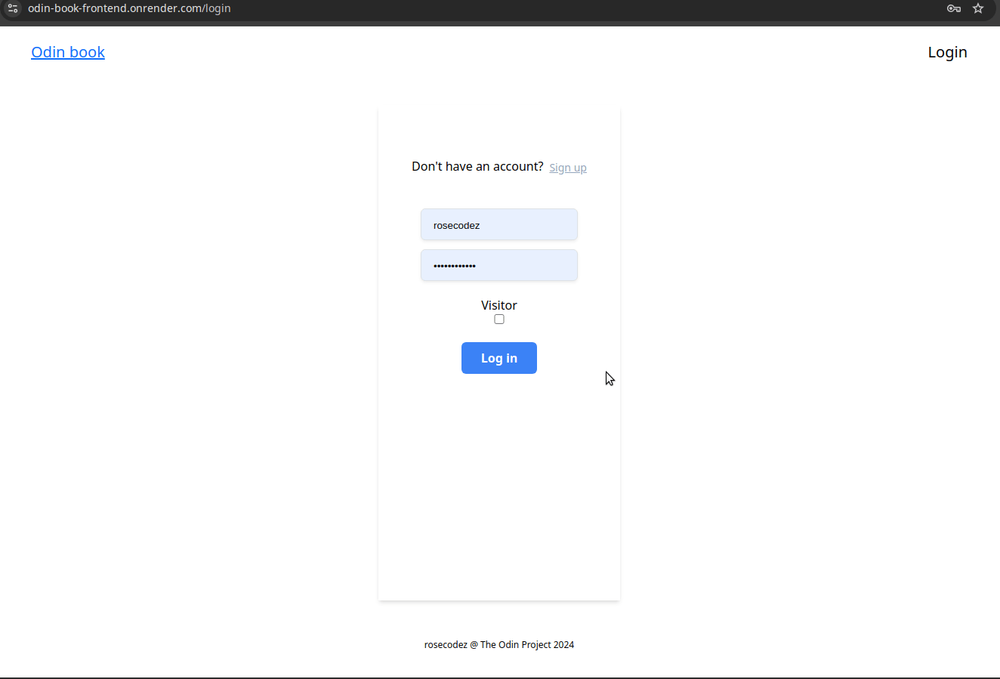
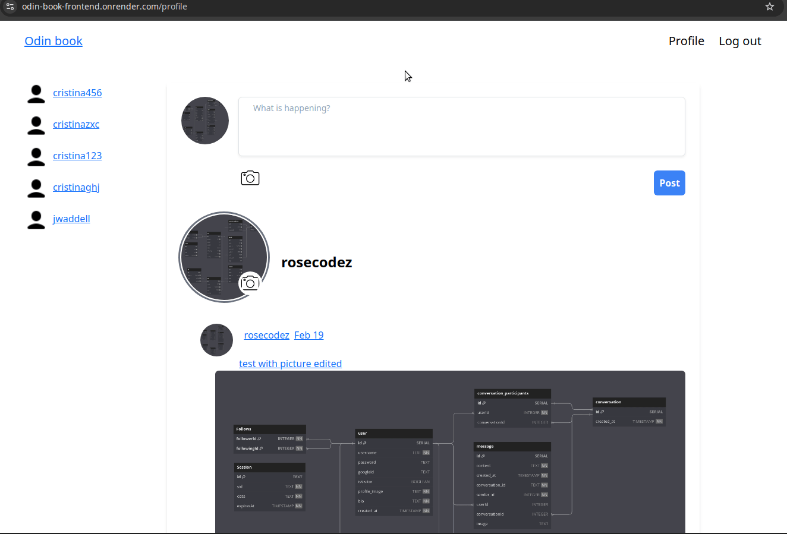
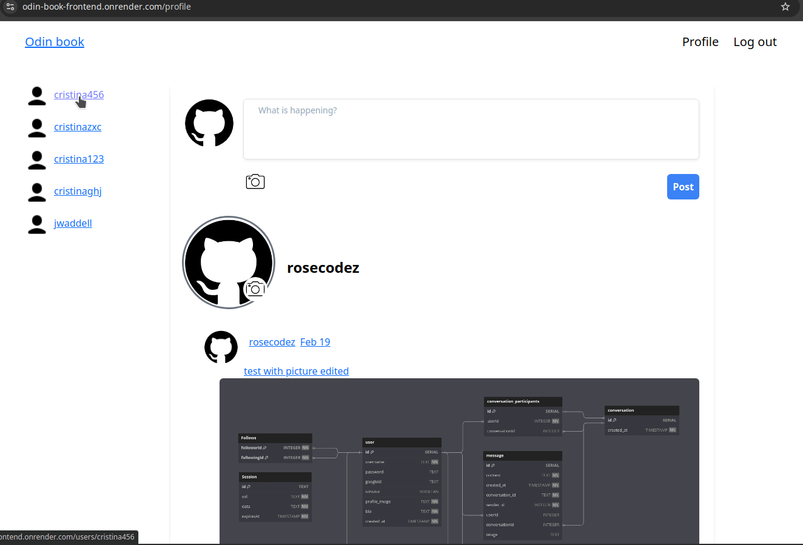
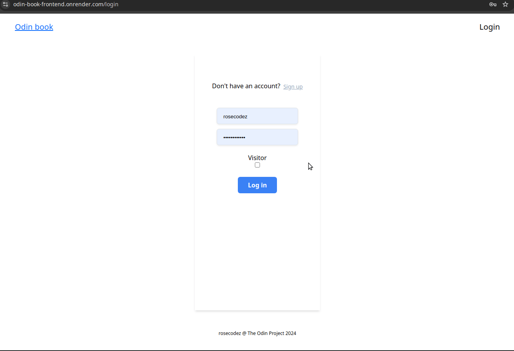

# Odin-Book

**Live Project**: https://odin-book-frontend.onrender.com/

**Odin-Book** is a full-stack social media application where users can post, follow, comment, and explore other profiles. It includes user authentication and a visitor mode for browsing without signing in.

## Demo

### Google Authentication

### Log in

### Post & Comment

### Follow

### Update Profile Picture

### Visitor Mode

## Features

- **User Profiles**- Create personal profile or fetch it from _Google_ account with photo/bio
- **Follow System**- Connect with people by following them
- **Post & Engagement**- Create posts, like, comment, and update content
- **Media Uploads**- Embed images in posts via _Cloudinary & Multer_
- **Visitor Mode**- Browse the platform without _signing in_

## Technologies

- **Prisma & PostgreSQL**- ORM & relational database for structured data
- **Node.js, Express**- Scalable backend for authentication & data handling
- **Passport.js** – Secure session-based authentication
- **Cloudinary & multer** - Image uploads
- **React with TailwindCSS** - Modern frontend with component-based UI & utility-first styling

## Planning

### Data models

.png>)

### API Documentation

#### Page Structure

## Challenges faced

- **CORS errors** - Resolved backend & frontend server mismatches
- **Many-to-Many Relationships** - Optimized follower/following system with Prisma
- **Google Profile Image Rate Limits** - Cached & stored profile images locally after first fetch
- **Visitor mode** - Ensured secure & seamless browsing experience
- **Responsive design** - Optimized for all screen sizes

## Features for improvement

- **WebSocket Integration**: Enable real-time notifications
- **Live Chat**: Support direct private messaging between users
