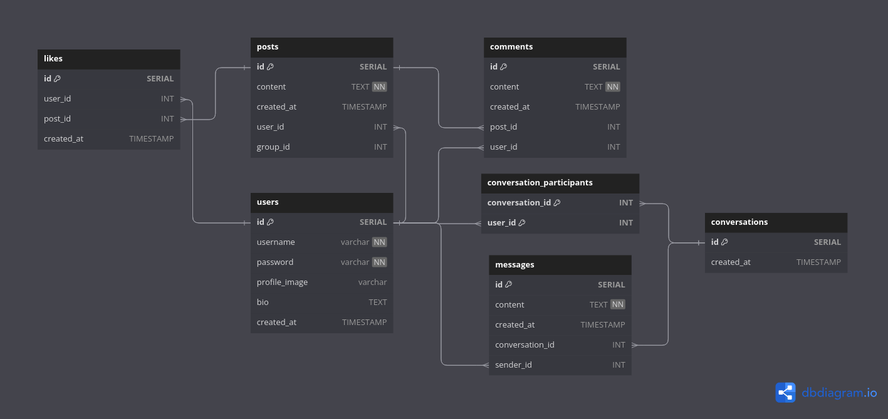

# Odin-Book

## Planning

Data models diagram

## Core functionality

### Backend

- nodejs.skeleton ✔️
- data models ✔️
- signup, logic, logout logic ✔️

### Frontend

- frontend react setup
- pages(home, feed, login, signup, profile)
- components(signup, login, update profile picture forms, posts, header, footer, profile, dropdown to update, delete post)

- users:

  - must sign in to see anything except the sign-in page ✔️
  - should be able to sign in using your chosen authentication method ✔️
  - can send follow requests to other users ✔️
  - can create posts ✔️
  - can like posts ✔️
  - can comment on posts ✔️
  - can create a profile with a profile picture, depending on how you handle authentication, for example with passport-github2, you may be able to use their accounts existing profile picture ✔️
  - profile page should contain their profile information, photo and posts

- posts:
  - should always display the post content, author, comments and likes ✔️
  - index page for posts(shows all recent posts from the current user and users they are following)
- index page for users, which shows all users and buttons for sending follow requests to users the user is not already following or have a pending request ✔️

- deploy

## Ideas

- make posts allow images ✔️
- allow users to send images as text ✔️
- allow users to update their profile photo ✔️
- create a sign-in functionality that allows visitors to bypass the logic screen without creating an account or supplying credentials ✔️
- check if user is authenticated middleware ✔️
- pretty!

## Dependencies

### Backend

- passport-google-oidc - Sign In With Google
- register app with Google, done with API & Services at Google Cloud Platform with OAuth2
- cloudinary.v2 multer image upload to posts/profile picture
- data modeling
  npm packages:

- bcrypt, dotenv, cors, express-session, path, express-async-handler, express-validator for body, multer, cloudinaryStorage, passport

### Frontend

- React
- CSS, Tailwind, Bootstrap

#### Plan

#### Data modeling

#### Basic page structure

- footer and header are always displayed
- page content displays rendered component/s according to specific page
