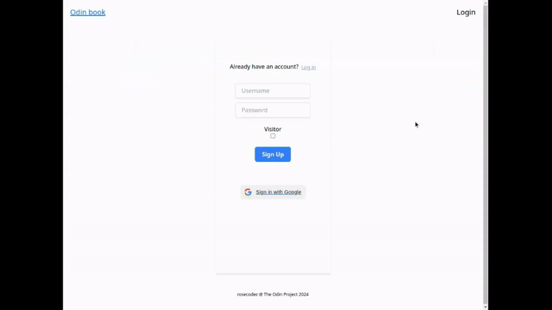
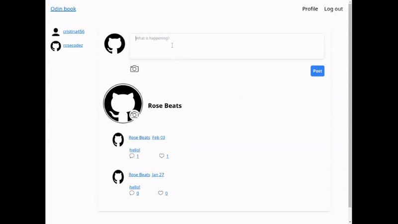
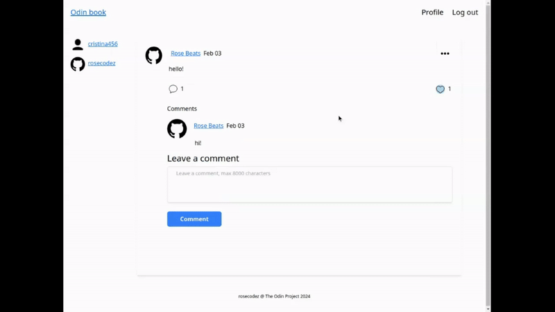
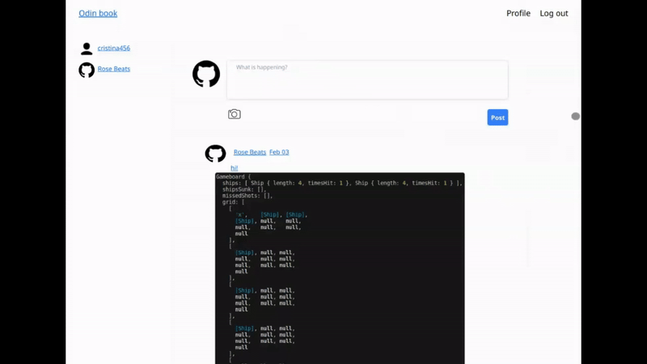
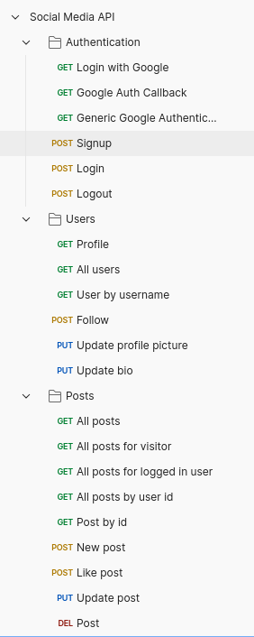
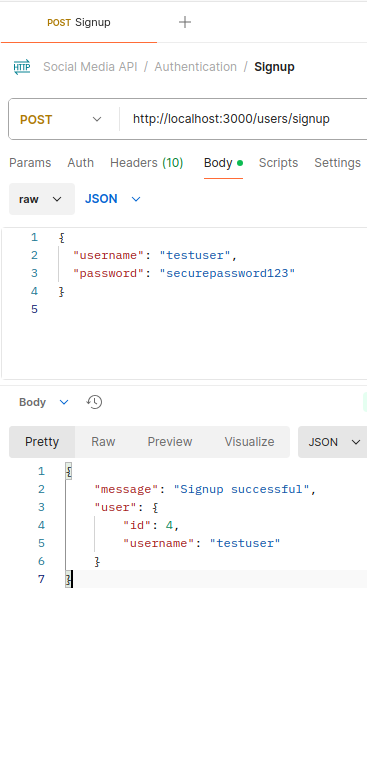
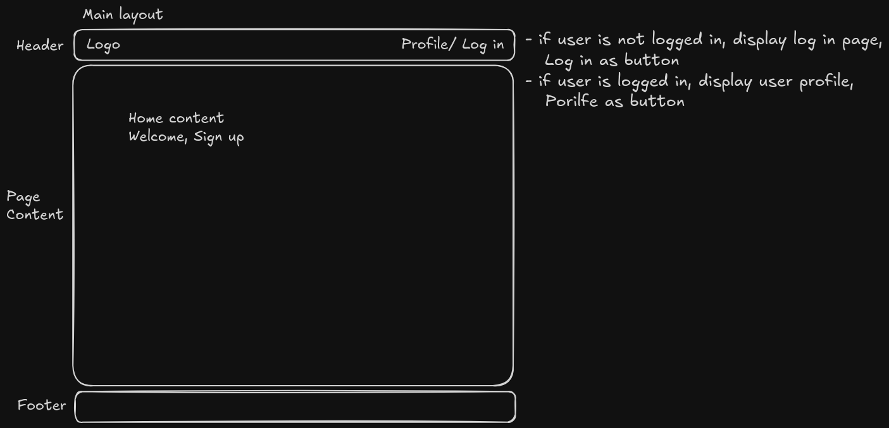

# Odin-Book

Odin-Book is a full-stack social media application where users can post, follow, comment, and explore other profiles. It includes user authentication and a visitor mode for browsing without signing in.

## Technologies

### Backend

Node.js with Express

- for a scalable, event driven architecture, perfect for handling numerous requests, such as user authentication and data fetching

PostgreSQL with Prisma ORM

- offers a robust relational database for structured data like user and post interactions
- prisma simplifies database interactions, offering type safety and rapid development

Authentication (Passport.js)

- passport.js is a versatile middleware for handling secure user authentication

Cloudinary and multer for image management

- Cloudinary handles image uploads efficiently, ensuring optimized image delivery

### Frontend

React with TailwindCSS

- React's component based architecture simplifies building reusable UI elements, while Tailwind provides a modern, utility-first approach for styling, enabling faster, consistent designs

### API Documentation

## Planning

Data models diagram

.png>)

## Dependencies

### Backend

- Passport.js, Google OAuth2.0 Strategy
- cloudinary.v2 + multer to upload image to posts/profile picture
- Prisma (for data modeling and database queries)

#### npm packages:

- bcrypt, dotenv, cors, express-session, path, express-async-handler, express-validator, multer, cloudinaryStorage

### Frontend

- React
- Tailwind

#### Basic page structure

#### Layout:

- Footer and header are always displayed
- Dynamic page content is rendered based on the current route

## Challenges faced

- CORS errors, between the `backend(localhost:3000)` and frontend `(localhost:5173)`
- managing complex many-to-many relationships (e.g., followers/following).
- `429 Too Many Requests` GET profile image from Google account, needing to save it locally after fetching it once
- implementing visitor mode without compromising security or user experience posed challenges in state management
- responsive design (for all devices)

## Features for improvement

- WebSocket for real time notifications
- direct private conversations between users

## Acknowledgments

I would like to acknowledge the following resources that contributed to the development of Odin-Book:

[The Odin Project](https://www.theodinproject.com/lessons/node-path-nodejs-odin-book) – Provided foundational knowledge and project inspiration

[React](https://react.dev/) – Essential guide for building the frontend components.

[Express.js](https://expressjs.com/) – Used for backend development.

[Prisma ORM](https://www.prisma.io/docs) – Database technology for managing user data.
